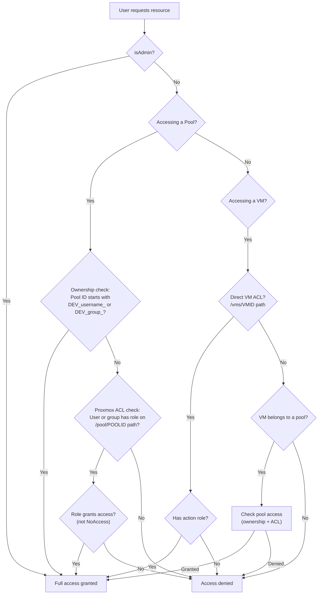

# Access Control & Permissions

This document covers Uma's multi-layered access control system, which bridges LDAP group memberships with Proxmox ACLs to determine what each user can see and do.

---

## Overview

Uma enforces access control at two levels:
1. **Application level** — Middleware protects routes based on authentication and admin status
2. **Resource level** — The ACL engine (`lib/acl.ts`) determines per-pool and per-VM access by querying Proxmox ACLs

Admins bypass all resource-level checks. Non-admin users must satisfy pool ownership, direct ACLs, or group membership.

---

## Permission Resolution Flow



---

## Role Definitions

Proxmox defines several built-in roles. Uma recognizes these categories:

### VM Action Roles

These roles allow performing power actions, configuration changes, snapshots, and other VM operations:

- `Administrator`
- `PVEAdmin`
- `PVEVMAdmin`
- `PVEVMUser`

### Pool Access Roles

These roles allow viewing pool contents and resources:

- `Administrator`
- `PVEAdmin`
- `PVEVMAdmin`
- `PVEVMUser`
- `PVEPoolUser`

### Pool Management Roles

These roles allow creating/deleting VMs within a pool and modifying pool settings:

- `Administrator`
- `PVEAdmin`

### Non-Access Roles

ACL entries with these roles are treated as explicit denials:

- `NoAccess`
- Any role matching patterns: `no_access`, `no-access`, `deny`

---

## Pool Ownership

Uma uses a naming convention to determine pool ownership without querying Proxmox ACLs:

```
DEV_<owner>_<number>
```

### User Ownership

If a pool's ID starts with `DEV_<username>_`, the user is the owner and has full management rights.

The username is matched using several variants to handle different LDAP formats:
- Raw username: `jsmith`
- Lowercase: `jsmith`
- Without domain prefix: If username is `DOMAIN\jsmith`, also matches `jsmith`
- Without realm suffix: If username is `jsmith@realm`, also matches `jsmith`

### Group Ownership

If a pool's ID starts with `DEV_<groupname>_`, all members of that group are owners.

Group name extraction:
1. Extract the CN from the LDAP group DN: `CN=DevTeam,OU=Groups,DC=...` → `DevTeam`
2. Also try with the `PROXMOX_USER_REALM` suffix: `DevTeam-SDC`
3. Special characters in group names are replaced with underscores for matching

### Examples

| Pool ID | Owner | Type |
|---|---|---|
| `DEV_jsmith_1` | User `jsmith` | User ownership |
| `DEV_DevTeam_1` | Group `DevTeam` | Group ownership |
| `DEV_DevTeam-SDC_1` | Group `DevTeam` (with realm suffix) | Group ownership |
| `PROD_webservers` | No ownership match | Requires explicit ACL |

---

## Proxmox ACL Integration

When ownership doesn't apply, Uma queries the Proxmox API for ACL entries.

### ACL Resolution for Pools

1. Fetch all ACLs from Proxmox (`GET /access/acl`)
2. Filter to entries where `path` matches `/pool/<poolId>`
3. For each matching ACL:
   - If `type` is `user`: check if `ugid` matches the current user (with variants)
   - If `type` is `group`: check if `ugid` matches any of the user's LDAP groups (with variants)
4. Extract roles from matching ACLs
5. If any role is a "non-access" role, deny entirely
6. If any role is in the access role set, grant access
7. If any role is in the management role set, grant management rights

### ACL Resolution for VMs

1. Check for direct ACLs on `/vms/<vmid>`
2. If no direct ACL, look up the VM's pool membership via `GET /cluster/resources?type=vm`
3. If the VM belongs to a pool, check pool access (ownership + ACL)

---

## Group ID Matching

LDAP group names come in various formats. Uma builds multiple variants for each group to maximize match success against Proxmox ACLs:

| Source Group | Generated Variants |
|---|---|
| `CN=DevTeam,OU=Groups,DC=corp,DC=com` | `DevTeam`, `devteam`, `DevTeam-SDC`, `devteam-sdc`, full raw DN |
| `Infrastructure` | `Infrastructure`, `infrastructure`, `Infrastructure-SDC`, `infrastructure-sdc` |

The `PROXMOX_USER_REALM` variable controls the realm suffix appended to group names.

---

## VNC Console Access

VNC access is checked separately in `server.js` because it runs outside the Next.js routing layer. The `checkVMAccessInline()` function mirrors the logic from `lib/acl.ts`:

1. Validate iron-session from the WebSocket upgrade request
2. Check if user is admin (bypass)
3. Check direct VM ACL
4. Check pool membership and pool ownership/ACL

This ensures users can only open consoles to VMs they have access to, even though the WebSocket connection bypasses the normal API middleware.

---

## API Route Protection

Each API route independently verifies access:

```typescript
// Typical pattern in a Proxmox API route
const session = await getIronSession<SessionData>(request, response, sessionOptions);
if (!session.user?.isLoggedIn) {
    return NextResponse.json({ error: "Unauthorized" }, { status: 401 });
}

// Check VM access for non-admin users
if (!session.user.isAdmin) {
    const hasAccess = await checkVMAccess(
        session.user.username,
        session.user.groups || [],
        vmid
    );
    if (!hasAccess) {
        return NextResponse.json({ error: "Forbidden" }, { status: 403 });
    }
}
```

### Pool List Filtering

The pool list endpoint uses the lightweight `checkPoolOwnership()` function (which only checks naming conventions, not Proxmox ACLs) to filter the pool list. This prevents non-admin users from seeing pools they don't own, even if broad ACLs would technically grant them access.
