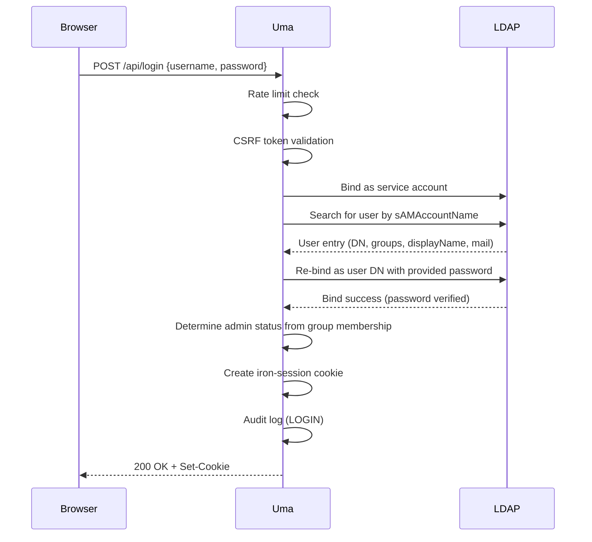

# Authentication & Session Management

This document covers how Uma authenticates users against LDAP/Active Directory, manages sessions, and determines administrative privileges.

---

## Overview

Uma does not manage its own user credentials. Instead, it delegates authentication to an external LDAP or Active Directory server. Once authenticated, user identity is stored in an encrypted, HTTP-only session cookie managed by `iron-session`.



---

## LDAP Configuration

### Required Variables

| Variable | Description | Example |
|---|---|---|
| `LDAP_URL` | LDAP server URL | `ldap://dc.example.com:389` or `ldaps://dc.example.com:636` |
| `LDAP_BIND_DN` | Service account Distinguished Name | `CN=svc-uma,OU=Service Accounts,DC=example,DC=com` |
| `LDAP_BIND_PASSWORD` | Service account password | |
| `LDAP_BASE_DN` | Base DN for user searches | `DC=example,DC=com` |

### Optional Variables

| Variable | Default | Description |
|---|---|---|
| `LDAP_USER_SEARCH_FILTER` | `(sAMAccountName={{username}})` | Filter template; `{{username}}` is replaced with the login input |
| `LDAP_SEARCH_ATTRIBUTES` | `sAMAccountName,cn,memberOf,mail,displayName` | Attributes to retrieve on user search |
| `LDAP_GROUPS_BASE_DN` | Same as `LDAP_BASE_DN` | Separate base DN for group searches (used by admin user/group search) |
| `LDAP_ALLOW_INSECURE_TLS` | `false` | Skip certificate validation for LDAPS (testing only) |

### Active Directory Example

```ini
LDAP_URL=ldaps://dc01.corp.example.com:636
LDAP_BIND_DN=CN=svc-uma,OU=Service Accounts,DC=corp,DC=example,DC=com
LDAP_BIND_PASSWORD=S3cur3P@ssw0rd
LDAP_BASE_DN=DC=corp,DC=example,DC=com
LDAP_USER_SEARCH_FILTER=(sAMAccountName={{username}})
LDAP_SEARCH_ATTRIBUTES=sAMAccountName,cn,memberOf,mail,displayName
```

### OpenLDAP Example

```ini
LDAP_URL=ldap://ldap.example.com:389
LDAP_BIND_DN=cn=admin,dc=example,dc=com
LDAP_BIND_PASSWORD=admin-password
LDAP_BASE_DN=dc=example,dc=com
LDAP_USER_SEARCH_FILTER=(uid={{username}})
LDAP_SEARCH_ATTRIBUTES=uid,cn,memberOf,mail,displayName
```

---

## Authentication Process (Detail)

The `LdapService` class (`lib/ldap.ts`) handles authentication in five steps:

1. **Create client** — A fresh LDAP connection is opened for each authentication attempt (no connection pooling). Timeout: 5 seconds for both connect and operations.

2. **Service account bind** — The application binds as the service account (`LDAP_BIND_DN`) to perform the user search. This account needs read access to the user directory.

3. **User search** — Searches the `LDAP_BASE_DN` subtree using the configured filter. The `{{username}}` placeholder is replaced with the LDAP-escaped input to prevent injection. If no entry is found, authentication fails with "Invalid credentials".

4. **User bind (password verification)** — The application re-binds as the found user's DN using the provided password. This is the actual password check — LDAP verifies the credentials.

5. **Extract details** — On successful bind, the user's `displayName`, `mail`, and `memberOf` groups are extracted. The connection is always closed in a `finally` block.

### Input Sanitization

All user input passed to LDAP filters is escaped using `ldap-escape` to prevent LDAP injection attacks. The username is sanitized before being inserted into the search filter template.

---

## Admin Determination

A user is flagged as `isAdmin` if any of their LDAP group memberships (from `memberOf`) match the `ADMIN_GROUPS` environment variable.

```ini
ADMIN_GROUPS="Domain Admins,IT-Administrators,Infrastructure"
```

The matching logic:
1. Extract the CN (Common Name) from each LDAP group DN (e.g., `CN=Domain Admins,OU=Groups,DC=...` → `Domain Admins`)
2. Compare against the comma-separated list in `ADMIN_GROUPS`
3. If any group matches, `isAdmin = true`

Admin users bypass all ACL checks and have full access to every pool, VM, and admin panel.

---

## Session Management

### iron-session

Sessions are encrypted and stored entirely in the cookie — there is no server-side session store. This makes the application stateless and horizontally scalable.

| Property | Value |
|---|---|
| Library | `iron-session` v8 |
| Cookie Name | `proxmox-wrapper-session` |
| Encryption | AES-256 (sealed) |
| Password Requirement | Minimum 32 characters |
| Storage | Cookie only (no server-side state) |

### Session Data Structure

```typescript
interface SessionData {
    user?: {
        username: string;        // LDAP username (sAMAccountName or uid)
        displayName?: string;    // LDAP displayName
        isLoggedIn: boolean;     // Always true when session exists
        dn?: string;             // Full LDAP Distinguished Name
        groups?: string[];       // Raw memberOf values
        isAdmin?: boolean;       // Derived from ADMIN_GROUPS
    };
    csrfToken?: string;          // CSRF protection token
}
```

### TTL (Time To Live)

| Environment | Allowed Range | Default |
|---|---|---|
| Development | 0 (no expiry) to unlimited | 28,800s (8 hours) |
| Production | 1s to 43,200s (12 hours) | 28,800s (8 hours) |

Setting `SESSION_TTL=0` is allowed in development but rejected in production to prevent indefinite sessions.

### Cookie Security

| Flag | Value | Purpose |
|---|---|---|
| `httpOnly` | `true` | Prevents JavaScript access (XSS protection) |
| `secure` | `true` in production | Cookie only sent over HTTPS |
| `sameSite` | `lax` | Allows navigation from external links |
| `path` | `/` | Available across the entire application |
| `domain` | Configurable via `COOKIE_DOMAIN` | Set for cross-subdomain use if needed |

### Startup Validation

The session module (`lib/session.ts`) performs strict validation at application startup. The server will **refuse to start** if:

- `SECRET_COOKIE_PASSWORD` is missing
- `SECRET_COOKIE_PASSWORD` is shorter than 32 characters
- `SESSION_TTL` is 0 in production
- `SESSION_TTL` exceeds 43,200 seconds in production
- `USE_SECURE_COOKIE` is `false` in production

This fail-fast behavior prevents misconfigurations from reaching production.

---

## CSRF Protection

Login requests are protected against Cross-Site Request Forgery. The CSRF token is:

1. Generated server-side and stored in the session
2. Sent to the client via the `x-csrf-token` response header
3. Required on subsequent state-changing requests

The CSRF module lives in `lib/csrf.ts`.

---

## Logout

`POST /api/logout` destroys the session by calling `session.destroy()`, which removes the encrypted cookie. An audit log entry is created.

---

## User Search (Admin Feature)

The `LdapService.searchUsers()` method allows administrators to search for users by username, common name, or email. Results are limited to 10 entries to prevent directory harvesting. Similarly, `LdapService.searchGroups()` searches for groups by CN with a limit of 20 results. These are used in the admin panel for ACL management and chat user search.
