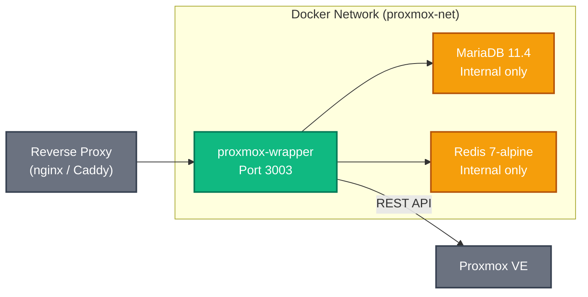

# Deployment Guide

This document covers deploying Uma in production with Docker Compose, configuring a reverse proxy, and hardening the stack for real-world use.

---

## Prerequisites

| Requirement | Minimum Version |
|---|---|
| Docker Engine | 24+ |
| Docker Compose | v2+ |
| Proxmox VE | 7.x or 8.x |
| LDAP/AD Server | Any (Active Directory, OpenLDAP, FreeIPA) |

A machine with at least **2 GB RAM** and **10 GB disk** is recommended for the full stack (app + MariaDB + Redis).

---

## Docker Compose Stack

The `docker-compose.yml` defines three services:



### Service Details

**App (`proxmox-wrapper`)**
- Multi-stage Dockerfile: `deps` → `builder` → `runner`
- Runs as non-root user `nextjs:nodejs` (UID/GID 1001)
- Entrypoint script (`docker-entrypoint.sh`) runs `prisma db push` before starting the server, ensuring tables exist on first boot
- Exposes port **3003**
- Volume mount: `./public/uploads:/app/public/uploads` for user-uploaded media

**Database (`proxmox-db`)**
- MariaDB 11.4 with persistent volume `db_data`
- Not exposed to the host — only accessible within the `proxmox-net` bridge network
- Credentials set via environment variables (`MYSQL_ROOT_PASSWORD`, `MYSQL_USER`, `MYSQL_PASSWORD`, `MYSQL_DATABASE`)

**Redis (`proxmox-redis`)**
- Redis 7 Alpine with password authentication
- Configured with 256 MB memory limit and LRU eviction (`allkeys-lru`)
- Persistent volume `redis_data`
- Used for rate limiting; falls back to in-memory if unavailable

---

## Step-by-Step Deployment

### 1. Clone and Configure

```bash
git clone https://github.com/your-org/proxmox-wrapper.git
cd proxmox-wrapper
cp .env.example .env.local
```

Edit `.env.local` with your production values. At minimum, set:

```ini
# Proxmox
PROXMOX_URL=https://your-proxmox:8006
PROXMOX_TOKEN_ID=root@pam!proxmox-wrapper
PROXMOX_TOKEN_SECRET=your-token-uuid
PROXMOX_USER_REALM=SDC

# LDAP
LDAP_URL=ldaps://dc.example.com:636
LDAP_BIND_DN=CN=svc-uma,OU=Service Accounts,DC=example,DC=com
LDAP_BIND_PASSWORD=strong-service-password
LDAP_BASE_DN=DC=example,DC=com

# Session
SECRET_COOKIE_PASSWORD=$(node scripts/generate-secrets.js 2>/dev/null | head -1)
SESSION_TTL=28800

# Database
MYSQL_ROOT_PASSWORD=root-password-here
MYSQL_DATABASE=proxmox_wrapper
MYSQL_USER=proxmox
MYSQL_PASSWORD=db-password-here

# Redis
REDIS_PASSWORD=redis-password-here

# Admin
ADMIN_GROUPS="Domain Admins,IT-Admins"
```

### 2. Build and Start

```bash
docker compose up -d --build
```

The first start will:
1. Build the multi-stage Docker image
2. Start MariaDB and wait for it to initialize
3. Start Redis
4. Run `prisma db push` to create all database tables
5. Start the Next.js application

### 3. Verify

```bash
# Check all services are running
docker compose ps

# Check app logs
docker compose logs -f app

# You should see:
# > Ready on http://localhost:3003
# > Socket.IO Server initialized
# > WebSocket proxy enabled for /api/proxy/vnc
```

### 4. Initialize Hardware Templates (Optional)

If you want seed data for VM hardware templates:

```bash
docker compose exec app npx ts-node scripts/init-templates.ts
```

---

## Reverse Proxy Configuration

In production, Uma should sit behind a reverse proxy that handles SSL termination.

### Nginx

```nginx
server {
    listen 443 ssl http2;
    server_name uma.example.com;

    ssl_certificate     /etc/ssl/certs/uma.example.com.pem;
    ssl_certificate_key /etc/ssl/private/uma.example.com.key;

    # Required for WebSocket (Socket.IO + VNC)
    location / {
        proxy_pass http://127.0.0.1:3003;
        proxy_http_version 1.1;
        proxy_set_header Upgrade $http_upgrade;
        proxy_set_header Connection "upgrade";
        proxy_set_header Host $host;
        proxy_set_header X-Real-IP $remote_addr;
        proxy_set_header X-Forwarded-For $proxy_add_x_forwarded_for;
        proxy_set_header X-Forwarded-Proto $scheme;

        # Timeout for VNC sessions (long-lived)
        proxy_read_timeout 3600s;
        proxy_send_timeout 3600s;
    }

    # Increase body size for file uploads
    client_max_body_size 50M;
}

server {
    listen 80;
    server_name uma.example.com;
    return 301 https://$host$request_uri;
}
```

Key points:
- WebSocket upgrade headers are mandatory for Socket.IO and VNC
- Long proxy timeouts are needed for VNC console sessions
- `X-Real-IP` and `X-Forwarded-For` headers are used by rate limiting (enable `RATE_LIMIT_TRUST_PROXY=true`)

### Caddy

```caddyfile
uma.example.com {
    reverse_proxy localhost:3003
}
```

Caddy automatically provisions TLS certificates and handles WebSocket upgrades.

---

## Environment Variables for Production

Beyond the base configuration, set these for production:

```ini
NODE_ENV=production
USE_SECURE_COOKIE=true
PROXMOX_SSL_INSECURE=false

# If behind a reverse proxy:
RATE_LIMIT_TRUST_PROXY=true
RATE_LIMIT_TRUSTED_PROXIES=127.0.0.1,::1

# WebSocket origin validation
APP_ORIGIN=https://uma.example.com
ALLOWED_WS_ORIGINS=https://uma.example.com
```

---

## Multi-Stage Docker Build

The Dockerfile is optimized for minimal image size:

```
Stage 1: deps      — Install node_modules only (cached layer)
Stage 2: builder   — Copy source, generate Prisma client, run `next build`
Stage 3: runner    — Copy only built artifacts + runtime deps
```

The entrypoint script (`docker-entrypoint.sh`):
1. Fixes file permissions for `public/uploads`
2. Runs `npx prisma db push --skip-generate` to sync the schema
3. Switches to the non-root `nextjs` user via `su-exec`
4. Starts the server with `node server.js`

---

## Updating

```bash
# Pull latest changes
git pull origin main

# Rebuild and restart (zero-downtime if using rolling updates)
docker compose up -d --build

# Prisma schema changes are applied automatically on startup
```

If the Prisma schema has changed, `prisma db push` runs automatically on container start. For breaking schema changes, consider using `prisma migrate` instead — see [database.md](./database.md).

---

## Backup Strategy

### Database

```bash
# Manual backup
docker compose exec db mysqldump -u root -p proxmox_wrapper > backup_$(date +%Y%m%d).sql

# Restore
docker compose exec -T db mysql -u root -p proxmox_wrapper < backup_20250101.sql
```

### Uploaded Files

```bash
# Backup uploads volume
tar -czf uploads_backup.tar.gz ./public/uploads/
```

### Automated Backups

Consider a cron job:

```bash
0 2 * * * cd /opt/uma && docker compose exec -T db mysqldump -u root -pYOUR_ROOT_PASSWORD proxmox_wrapper | gzip > /backups/uma_$(date +\%Y\%m\%d).sql.gz
```

---

## Monitoring

### Health Checks

- **App**: `curl -f http://localhost:3003/api/auth` (returns 200 with session status)
- **Database**: `docker compose exec db mysqladmin ping -u root -p`
- **Redis**: `docker compose exec redis redis-cli -a YOUR_PASSWORD ping`

### Logs

All services log to stdout/stderr and are captured by Docker:

```bash
docker compose logs -f app       # Application logs
docker compose logs -f db        # Database logs
docker compose logs -f redis     # Redis logs
```

Audit events are logged both to the database `AuditLog` table and to stdout via the structured logger, so they appear in `docker compose logs`.

---

## Troubleshooting

| Symptom | Cause | Solution |
|---|---|---|
| App crashes on start with "SECRET_COOKIE_PASSWORD" error | Cookie password missing or too short | Set `SECRET_COOKIE_PASSWORD` in `.env.local` (min 32 chars) |
| "ECONNREFUSED" to database | MariaDB not ready yet | Wait for `db` container to be healthy; check `docker compose logs db` |
| Session lost after restart | Cookie domain mismatch | Set `COOKIE_DOMAIN` if using a reverse proxy domain |
| VNC console connects but shows nothing | Proxmox TLS rejected | Set `PROXMOX_SSL_INSECURE=true` for self-signed certs |
| Rate limit errors in development | Redis not running | Set `DISABLE_REDIS=true` for local dev |
| LDAP bind fails | Wrong credentials or TLS issue | Check `LDAP_URL`, `LDAP_BIND_DN`, `LDAP_BIND_PASSWORD`; try `LDAP_ALLOW_INSECURE_TLS=true` for testing |
| WebSocket origin rejected | Missing origin config | Set `APP_ORIGIN` and `ALLOWED_WS_ORIGINS` to your domain |
