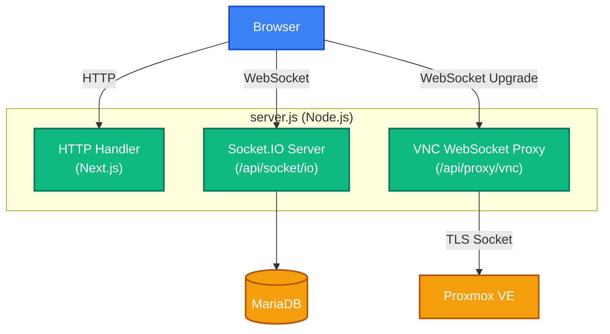
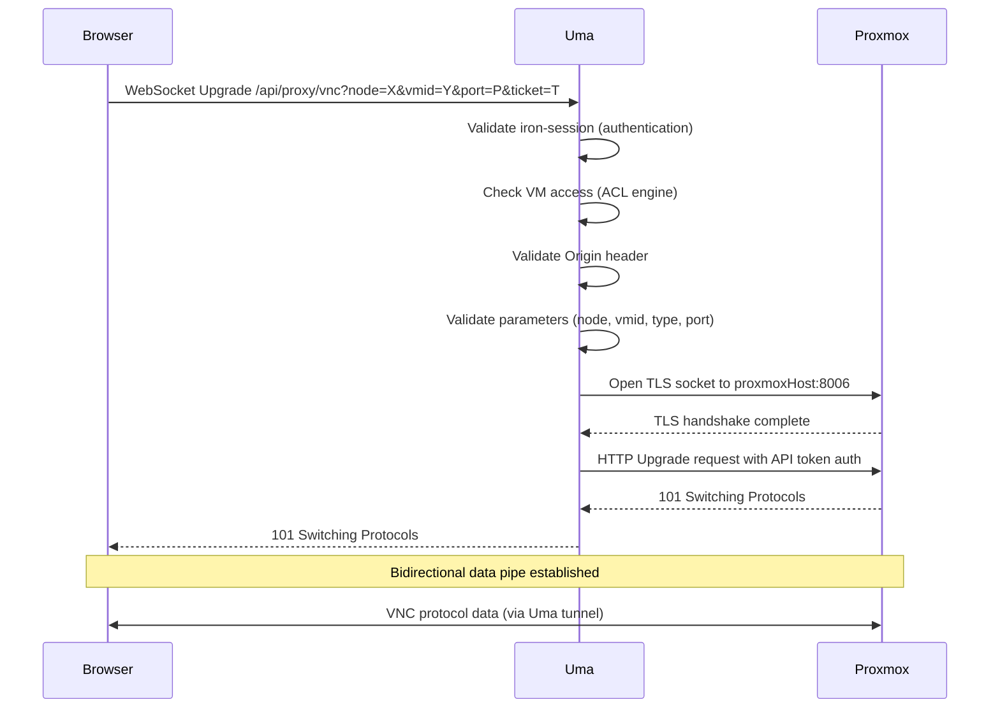

# Real-Time Systems

This document covers Uma's real-time features: the Socket.IO chat and whiteboard system, the VNC WebSocket proxy, and their configuration and troubleshooting.

---

## Architecture

Uma's custom `server.js` entry point hosts two real-time systems alongside the Next.js application:



The `server.js` `upgrade` handler routes WebSocket connections:
- Paths starting with `/api/socket/io` are handled by Socket.IO automatically
- The path `/api/proxy/vnc` is routed to the custom VNC proxy
- All other upgrade requests are delegated to Next.js (for HMR in development)

---

## Socket.IO — Chat & Whiteboard

### Server Configuration

Socket.IO is initialized in `lib/socket-server-js.js` and attached to the HTTP server:

```javascript
const io = new SocketIOServer(server, {
    path: "/api/socket/io",
    addTrailingSlash: false,
    cors: {
        origin: process.env.APP_ORIGIN || false,
        methods: ["GET", "POST"],
        credentials: true,
    },
});
```

Setting `APP_ORIGIN` is required for cross-origin deployments (e.g., when the reverse proxy domain differs from the app port).

### Authentication Middleware

Every Socket.IO connection is authenticated using iron-session:

1. Extract the session cookie from the WebSocket handshake request
2. Decrypt using `getIronSession()` with the same session options as the HTTP middleware
3. Verify `session.user.isLoggedIn` and `session.user.username`
4. Attach the user object to `socket.user` for use in event handlers
5. Reject unauthorized connections with an error

### Connection Lifecycle

When a user connects:

1. Join the personal room `user:<username>` for DM delivery
2. Sync or create the user profile in the database
3. Broadcast presence status (if `showOnlineStatus` is enabled in settings)
4. Auto-join the "General" public channel (created on first use)
5. Join the `whiteboard` room for collaborative drawing

### Chat Events

**Sending Messages**

| Event | Payload | Validation |
|---|---|---|
| `send_message` | `{ to?: string, groupId?: string, content: string }` | Zod schema, min 1 / max 5000 chars |
| `edit_message` | `{ messageId: string, content: string }` | Owner check, Zod schema |
| `delete_message` | `{ messageId: string }` | Owner check, soft delete |
| `add_reaction` | `{ messageId: string, emoji: string }` | Emoji validation, toggle behavior |

All message content is sanitized with DOMPurify before storage to prevent XSS.

**Message Delivery**

- **Direct messages**: Emitted to `user:<receiver_username>` room
- **Group messages**: Emitted to `group_<groupId>` room
- **Sender acknowledgment**: `message_sent` event with the saved message

**Privacy & Blocking**

Before delivering a direct message:
1. Check if the sender is blocked by the receiver
2. Check the receiver's `allowMessagesFrom` setting (`everyone` / `none`)
3. Reject with an error if blocked or privacy settings prevent delivery

**Typing & Read Receipts**

| Event | Direction | Description |
|---|---|---|
| `typing` | Client to Server | Broadcast typing indicator to conversation partner |
| `mark_read` | Client to Server | Mark messages as read, broadcast delivery status |

### Whiteboard Events

The collaborative whiteboard allows real-time drawing synchronized across all connected users.

| Event | Payload | Restrictions |
|---|---|---|
| `draw_stroke` | Stroke object (points, color, width) | Max 16 KB per stroke |
| `draw_save` | `{ strokes: StrokeObject[] }` | Admin only, max 10 MB |
| `draw_clear` | None | Admin only |

Strokes are broadcast to all users in the `whiteboard` room. The full canvas state is persisted to the `WhiteboardState` table by admin users. On page load, the client fetches saved state via the REST API.

### Rate Limiting

Each socket connection maintains per-event rate counters:

| Event | Max | Window |
|---|---|---|
| `draw_stroke` | 1,000 | 10 seconds |
| `send_message` | 40 | 60 seconds |
| `edit_message` | 30 | 60 seconds |
| `delete_message` | 30 | 60 seconds |
| `add_reaction` | 80 | 60 seconds |
| `typing` | 120 | 10 seconds |
| `mark_read` | 120 | 60 seconds |
| `join_group` | 30 | 60 seconds |
| `draw_save` | 20 | 60 seconds |
| `draw_clear` | 20 | 60 seconds |

Additionally, every event payload is checked against a maximum size (default 128 KB, 16 KB for strokes, 10 MB for whiteboard saves). Oversized payloads are rejected.

### Audit Logging

All socket events generate audit log entries in the `AuditLog` table, including:
- Successful and failed message sends
- Rate limit violations
- Payload rejections
- Whiteboard save/clear operations
- Group join attempts
- Connection/disconnection events

---

## VNC WebSocket Proxy

### Purpose

The VNC proxy allows users to access VM consoles directly in the browser using `react-vnc`. It creates a WebSocket tunnel between the browser and the Proxmox VNC endpoint.

### Connection Flow



### Security Checks

The VNC proxy performs several validation steps before establishing the tunnel:

1. **Session authentication** — Iron-session cookie must be present and contain a logged-in user
2. **VM access check** — Non-admin users are checked against the ACL engine (direct VM ACLs, pool membership, pool ownership)
3. **Origin validation** — The `Origin` header must match one of:
   - An entry in `ALLOWED_WS_ORIGINS` (comma-separated)
   - The `APP_ORIGIN` value
   - The request `Host` header (fallback)
   - If `ALLOW_MISSING_WS_ORIGIN=true`, missing Origin headers are allowed (for development only)
4. **Parameter validation** — `node`, `vmid`, `type`, and `port` are validated against safe patterns; `type` must be `qemu` or `lxc`
5. **TLS configuration** — `PROXMOX_SSL_INSECURE=true` allows self-signed certificates on the Proxmox side

### Query Parameters

| Parameter | Required | Description |
|---|---|---|
| `node` | Yes | Proxmox node name |
| `vmid` | Yes | VM or container ID |
| `type` | Yes | `qemu` or `lxc` |
| `port` | Yes | VNC port (from ticket creation) |
| `ticket` | Yes | VNC ticket (URL-encoded, from `POST /api/proxmox/vm/{vmid}/vnc`) |

### TLS Tunneling

Rather than using `http-proxy` (which has known issues with HTTPS WebSocket proxying), Uma opens a **raw TLS socket** to Proxmox and manually constructs the WebSocket upgrade request:

1. Open a `tls.connect()` connection to the Proxmox host
2. Construct an HTTP/1.1 upgrade request with:
   - The VNC WebSocket path with URL-encoded ticket
   - API token authorization header
   - WebSocket upgrade headers from the client request
3. Parse the Proxmox response headers
4. If 101 is received, forward the `Sec-WebSocket-Accept` header to the client
5. Pipe the two sockets bidirectionally

This approach avoids double-encryption issues and provides reliable WebSocket tunneling through HTTPS backends.

### Error Handling

Both sockets (client and Proxmox) have error and close handlers that clean up the other side:
- If the client disconnects, the Proxmox socket is closed
- If Proxmox disconnects, the client socket is closed
- TLS errors are logged and result in client disconnection

---

## Client Integration

### Socket.IO Client

The client connects using `socket.io-client`:

```typescript
import { io } from "socket.io-client";

const socket = io({
    path: "/api/socket/io",
    withCredentials: true,  // Send session cookie
});
```

State management for chat is handled by the Zustand store (`store/chat-store.ts`), which manages conversations, messages, typing indicators, and online presence.

### VNC Client

The VNC console uses `react-vnc` which connects to the proxy endpoint:

```
ws://localhost:3003/api/proxy/vnc?node=pve1&type=qemu&vmid=100&port=5900&ticket=PVEVNC:...
```

The ticket is obtained by calling `POST /api/proxmox/vm/{vmid}/vnc` first, which returns a ticket and port number from Proxmox.

---

## Troubleshooting

| Issue | Cause | Solution |
|---|---|---|
| Socket.IO fails to connect | CORS origin mismatch | Set `APP_ORIGIN` to your domain |
| Chat messages not delivered | User not in personal room | Verify session contains username |
| VNC shows blank screen | Ticket expired or invalid | Re-request VNC ticket; check Proxmox logs |
| VNC connection refused | Origin validation failed | Set `ALLOWED_WS_ORIGINS` or `APP_ORIGIN` |
| VNC TLS handshake error | Self-signed Proxmox cert | Set `PROXMOX_SSL_INSECURE=true` |
| Socket disconnects immediately | Authentication failure | Verify session cookie is being sent (`withCredentials: true`) |
| Whiteboard not syncing | Not in whiteboard room | Verify socket connection is established |
| Rate limit errors on socket | Too many events | Wait for the rate window to reset |
